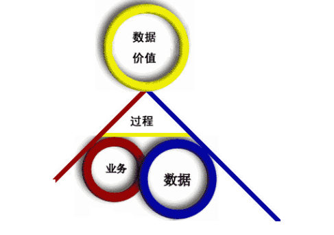
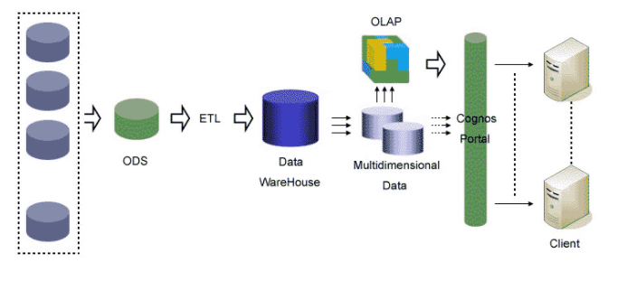
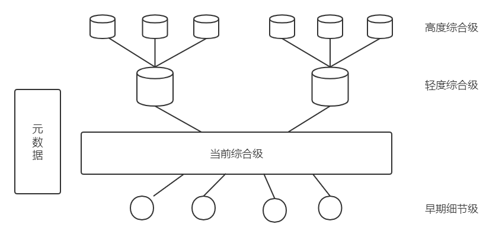
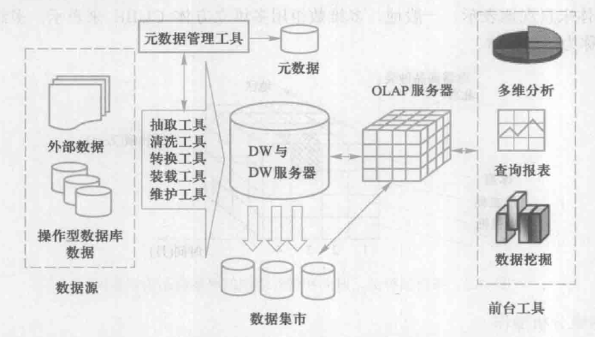
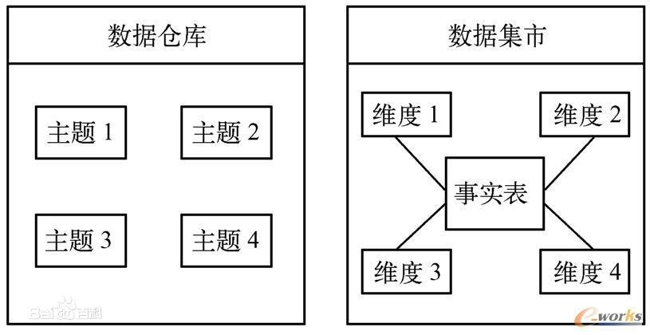

## Business Intelligence(BI) System介绍
本文内容笔记摘录自王珊和萨师煊的《数据库系统概论》以及网上写的比较好的博客[Business Intelligence](https://www.cnblogs.com/jiesin/archive/2008/06/23/1227694.html),[商务智能系统的组成](https://blog.csdn.net/ctpq29224/article/details/100273702),以及百度百科。
<!--more-->
### Business Intelligence System
BI是Business Intelligence的英文缩写，中文解释为商务智能，用来帮助企业更好地利用数据提高决策质量的技术集合，是从大量的数据中钻取信息与知识的过程。 

这样不难看出，传统的交易系统完成的是Business到Data的过程，而BI要做的事情是在Data的基础上，让Data产生价值，这个产生价值的过程就是Business Intelligence analyse的过程。

它以**数据仓库（Data Warehousing）**、**在线分析处理（OLAP）**、**数据挖掘(Data Mining)** 3种技术的整合为基础，建立企业数据中心和业务分析模型，以提高企业获取经营分析信息的能力，从而提高企业经营和决策的质量与速度。  

简单的说就是把交易系统已经发生过的数据，通过ETL工具抽取到主题明确的数据仓库中，OLAP后生成Cube或报表，透过Portal展现给用户，用户利用这些经过分类、聚集、描述和可视化的数据，支持业务决策。  

BI不能产生决策，而是利用BI过程处理后的数据来支持决策。那么BI所谓的智能到底是什么呢？ BI最终展现给用户的信息就是报表或图视，但它不同于传统的静态报表或图视，它颠覆了传统报表或图视的提供与阅读的方式，有力的保障了用户分析数据时操作的简单性、报表或图视直观性及思维的连惯性。

### Data warehouses 数据仓库
数据仓库和数据库只有一字之差，似乎是一样的概念，但实际则不然。数据仓库是为了构建新的分析处理环境而出现的一种数据存储和组织技术。  

基于操作型数据和分析型数据之间的区别，可以给出数据仓库的定义;**数据仓库是一个用以更好地支持企业（或组织）决策分析处理的、面向主题的、集成的、不可更新的、随时间不断变化的数据集合**。数据仓库本质上和数据库一样，是长期储存在计算机内的、有组织、可共享的数据集合。  

**一、数据仓库的基本特征:**
**数据仓库和数据库主要的区别是数据仓库中的数据具有以下4个基本特征.** 
**（1）主题与面向主题**
**数据仓库中的数据是面向主题进行组织的。**主题是一个在较高层次上对数据的抽象，这使得面向主题的数据组织可以独立于数据的处理逻辑，因而可以在这种数据环境上方便地开发新的分析型应用;同时这种独立性也是建设企业全局数据库所要求的，所以面向主题不仅适用于分析型数据环境的数据组织方式，同时也适用于建设企业全局数据库的组织。

**（2）数据仓库是集成的**
数据仓库的数据是从原有的分散的数据库数据中抽取来的，因此数据在进入数据仓库之前必然要经过加工与集成，统一与综合。**这一步实际是数据仓库建设中最关键、最复杂的一步。**

**（3）数据仓库是不可更新的**
**数据仓库主要供决策分析之用，所涉及的数据操作主要是数据查询，一般情况下并不进行修改操作。**数据仓库存储的是相当长一段时间内的历史数据，是不同时点数据库快照的集合，以及基于这些快照进行统计、综合和重组的导出数据，不是联机处理的数据。OLTP数据库中的数据经过抽取（Extracting)、清洗（Cleaning)、转换（Transformation）和装载(Loading）即ECTL存放到数据仓库中。一旦数据存放到数据仓库中，数据就不可再更新了。

**（4）数据仓库是随时间变化的**
**数据仓库中的数据不可更新，是指数据仓库的用户进行分析处理时是不进行数据更新操作的，但并不是说在数据仓库的整个生存周期中数据集合是不变的**。

数据仓库的数据是随时间的变化不断变化的，这一特征表现在以下三方面。
1. 数据仓库随时间变化不断增加新的数据内容。
2. 数据仓库随时间变化不断删去旧的数据内容。
3. 数据仓库中包含大量的综合数据，这些综合数据中很多与时间有关，如数据按照某一时间段进行综合，或隔一定的时间片进行采样等，这些数据就会随着时间的变化不断地进行重新综合。因此，数据仓库中数据的标识码都包含时间项，以标明数据的历史时期。

**二、数据仓库中的数据组织**
数据仓库中的数据分为多个级别:早期细节级、当前细节级、轻度综合级和高度综合级。源数据经过抽取、清洗、转换、装载进入数据仓库。首先进入当前细节级，根据具体的分析处理需求再进行综合，进而成为轻度综合级和高度综合级。随着时间的推移，早期的数据将转入早期细节级。

**三、数据仓库系统的体系结构**
**数据仓库系统的体系结构由数据仓库的后台工具、数据仓库服务器、OLAP服务器和前台工具组成。**

**数据仓库的后台工具**包括数据抽取、清洗、转换、装载和维护（maintain）工具，简记为 ECTL工具或ETL工具。  
**数据仓库服务器相当于数据库系统中的数据库管理系统**，它负责管理数据仓库中数据的存储管理和数据存取，并给OLAP服务器和前台工具提供存取接口(如SQL查询接口)。  
**OLAP服务器透明地为前台工具和用户提供多维数据视图**。用户不必关心它的分析数据（即多维数据）到底存储在什么地方，是怎么存储的。  

### Data marts
数据集市(Data Mart) ，也叫数据市场，数据集市就是满足特定的部门或者用户的需求，按照多维的方式进行存储，包括定义维度、需要计算的指标、维度的层次等，生成面向决策分析需求的数据立方体。

数据仓库是一个集成的、面向主题的数据集合，设计的目的是支持DSS（决策支持系统）功能。数据集市就是企业级数据仓库的一个子集，他主要面向部门级业务，并且只面向某个特定的主题。在数据结构上，数据仓库是面向主题的、集成的数据的集合。而数据集市通常被定义为星型结构或者雪花型数据结构，数据集市一般是由一张事实表和几张维表组成的。

数据集市可以分为两种：
**独立型数据集市：**
独立型数据集市的数据来自于操作型数据库，这类数据集市有自己的源数据库和ETL架构是为了满足特殊用户而建立的一种分析型环境。这种数据集市的开发周期一般较短，具有灵活性，但是因为脱离了数据仓库，独立建立的数据集市可能会导致信息孤岛的存在，不能以全局的视角去分析数据。

**从属型数据集市：**
这种数据集市没有自己的源系统，它的数据来自数据仓库。从属型数据集市的数据来自于企业的数据仓库，这样会导致开发周期的延长，但是从属型数据集市在体系结构上比独立型数据集市更稳定，可以提高数据分析的质量，保证数据的一致性

数据集市主要是针对一组特定的某个主题域、部门或者特殊用户需求的数据集合。这些数据需要针对用户的快速访问和报表展示进行优化，优化的方式包括对数据进行轻量级汇总，在数据结构的基础上创建索引。数据集市的目标分析过程包括对数据集市的需求进行拆分，按照不同的业务规则进行组织，将与业务主题相关的实体组织成主题域，并且对各类指标进行维度分析，从而形成数据集市目标说明书。内容包括详细的业务主题、业务主题域和各项指标及其分析维度。

 
