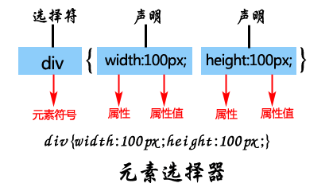
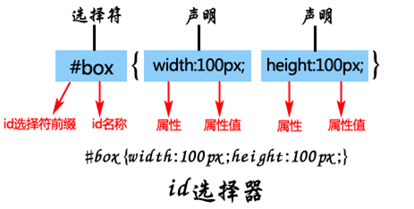
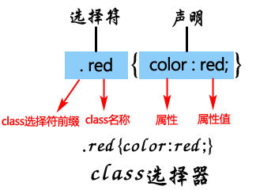
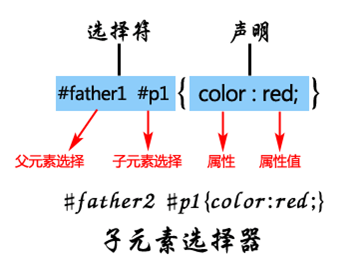
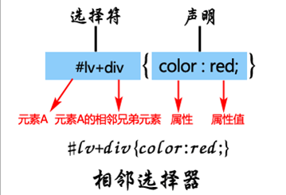
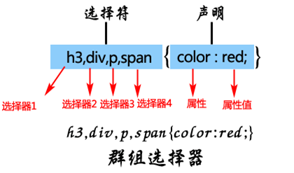
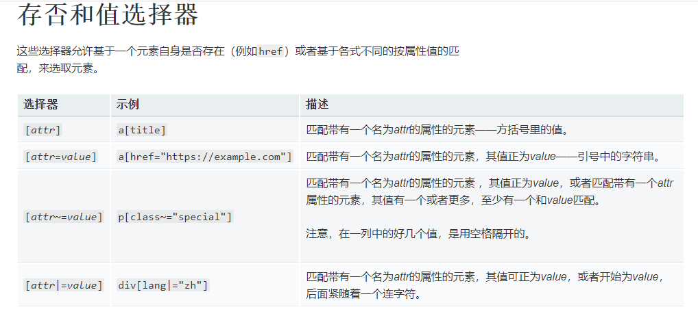
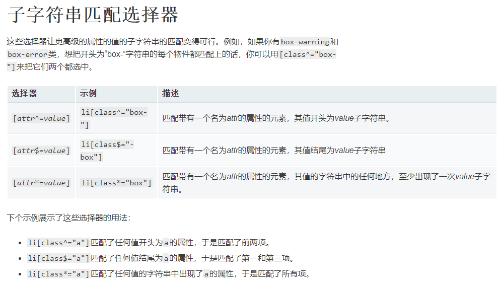

title: htmlcss回顾
tags:
  - web基础
categories: []
date: 2020-09-24 21:15:00
---
## html回顾
重回前端，文章是记录的[MDN Web Doc](https://developer.mozilla.org/zh-CN/docs/Web)和[绿叶学习网](http://www.lvyestudy.com/les_cj/css_list.aspx)的相关内容笔记。这里不会把基础知识列出来，这里主要是记录一些自己有新体会的东西。

<!--more-->

HTML 不是一门编程语言，而是一种用于定义内容结构的标记语言，超文本标记语言 (英语：Hypertext Markup Language，简称：HTML ) 是一种用来结构化 Web 网页及其内容的标记语言。

### 浏览器的同源策略

[同源策略](https://developer.mozilla.org/zh-CN/docs/Web/Security/Same-origin_policy)是一个重要的安全策略，它用于限制一个[origin](https://developer.mozilla.org/zh-CN/docs/Glossary/%E6%BA%90)的文档或者它加载的脚本如何能与另一个源的资源进行交互。它能帮助阻隔恶意文档，减少可能被攻击的媒介。

如果两个 URL 的 protocol、port (如果有指定的话)和 host 都相同的话，则这两个 URL 是同源。这个方案也被称为“协议/主机/端口元组”，或者直接是 “元组”。（“元组” 是指一组项目构成的整体，双重/三重/四重/五重/等的通用形式）。

下表给出了与 URL `http://store.company.com/dir/page.html` 的源进行对比的示例:

URL|	结果|	原因|
  :----:| :----:  |:----:  |
`http://store.company.com/dir2/other.html`|	同源|	只有路径不同
`http://store.company.com/dir/inner/another.html	`|同源	|只有路径不同
`https://store.company.com/secure.html`	|失败	|协议不同
`http://store.company.com:81/dir/etc.html`|	失败|	端口不同 ( http:// 默认端口是80)
`http://news.company.com/dir/other.html`	|失败	|主机不同

### 插入图片不推荐方式
```html

```
这种方式是不被推荐的，这样做只会使浏览器做更多的工作，例如重新通过 DNS 再去寻找 IP 地址。通常我们都会把图片和 HTML 放在同一个服务器上。

有一个**更好的做法**是使用 HTML5 的` <figure> `和 `<figcaption>` 元素，它正是为此而被创造出来的：为图片提供一个语义容器，在标题和图片之间建立清晰的关联。我们之前的例子可以重写为:
```html
<figure>
  
  <figcaption>曼彻斯特大学博物馆展出的一只霸王龙的化石</figcaption>
</figure>
```

### `<input>`

### formenctype属性
由于input元素是一个提交按钮，因此该formenctype属性指定用于向服务器提交表单的内容类型。可能的值为：
- application/x-www-form-urlencoded：如果未指定属性，则为默认值。
- multipart/form-data：如果`<input>`使用type属性设置为的元素，则使用此值file。
- text/plain

如果指定了此属性，它将覆盖`enctype`元素的表单所有者的属性。

### form属性
与按钮关联的表单元素（其表单所有者）。该属性的值必须是同一文档中元素的id属性`<form>`。如果未指定此属性，则该`<button>`元素必须是form元素的后代。此属性使您可以将`<button>`元素放置在文档中的任何位置，而不仅仅是`<form>`元素的后代。

### name属性
按钮的名称，与表单数据一起提交。

### type属性
按钮的类型。可能的值为：  
**submit**：按钮将表单数据提交到服务器。如果未指定属性，或者该属性动态更改为空或无效值，则这是默认设置。  
**reset**：按钮将所有控件重置为其初始值。  
**button**：该按钮没有默认行为。它可以具有与元素的事件相关联的客户端脚本，这些脚本在事件发生时触发。  

### value属性
按钮的初始值。

## 元素的id和class
### 元素的id属性
id属性被赋予了标识页面元素的唯一身份。如果一个页面出现了多个相同id属性取值，CSS选择器或者JavaScript就会因为无法分辨要控制的元素而最终报错。

### 元素的class属性
如果你要为两个元素或者两个以上元素定义相同的样式，建议使用class属性。

**（1）一个标签可以同时定义多个class；**
**（2）id也可以写成name，区别在于name是HTML中的标准，而id是XHTML中的标准，现在网页的标准都是使用id，所以大家尽量不要用name属性；**

## 选择器
1.元素选择器

2.id选择器

3.class选择器

4.子元素选择器
子元素选择器，就是选中某个元素下的子元素，然后对该子元素设置CSS样式。

5.相邻选择器
相邻选择器，就是选中该元素的下一个兄弟元素，在这里注意一点，相邻选择器的操作对象是该元素的同级元素。

6.群组选择器
群组选择器，就是同时对几个选择器进行相同的操作。

7.全局选择器
全局选择器，是由一个星号（`*`）代指的，它选中了文档中的所有内容（或者是父元素中的所有内容，比如，它紧随在其他元素以及邻代运算符之后的时候）下面的示例中，我们已经用全局选择器，移去了所有元素上的外边距
```css
* {
    margin: 0;
}
```
一些新用法



## ::before和::after
`::before`和`::after`伪元素与`content`属性的共同使用，在CSS中被叫做“生成内容”


## text-align属性
在CSS中，使用text-align属性控制文本的水平方向的对齐方式：左对齐、居中对齐、右对齐。

**text-align属性不仅对文本文字有效，对img标签也有效，但是对其他标签无效。**

|	text-align属性值|	说明|	
|  :----:| :----:  |
|	left	|默认值，左对齐|
|	center|	居中对齐|
|	right	|右对齐|


## 块元素和行内元素
1、HTML元素根据浏览器表现形式分为两类：块元素，行内元素；

2、块元素特点：
- 独占一行，排斥其他元素跟其位于同一行，包括块元素和行内元素；
- 块元素内部可以容纳其他块元素或行元素；

|	块元素|		说明|
|  :----:| :----:  |	
|	div	|	div层|	
|	h1～h6|		1到6级标题|	
|	p	段落|	会自动在其前后创建一些空白|	
|	hr|		分割线|	
|	ol	|	有序列表|	
|	ul	|	无序列表|	
3、行内元素特点：
- 可以与其他行内元素位于同一行；
- 行内内部可以容纳其他行内元素，但不可以容纳块元素，不然会出现无法预知的效果；

|	行内元素|	说明|
|  :----:| :----:  |	
|	strong|	加粗强调|
|	em	|斜体强调|
|	s|	删除线|
|	u	|下划线|
|	a	|超链接|
|	span|	常用行级，可定义文档中的行内元素|
|	img	|图片|
|	input	|表单|

## CSS边框（border）
任何块元素和行内元素都可以设置边框属性。
设置一个元素的边框必须要同时设置border-width、border-style、border-color这三个属性，这个元素的边框才能在浏览器显示出来。
```css
border-width:1px;
border-style:solid;
border-color:Red;
/*简介写法*/
border: 1px solid Red;
```
在CSS中，我们可以分别针对上下左右四条边框设置单独的样式。
```css
border-top-width:1px;
border-top-style:solid;
border-top-color:red;
/*简介写法*/
border-top: 1px solid Red;
border-bottom: 1px solid Red;
border-left: 1px solid Red;
border-right: 1px solid Red;

/*去除边框的两种方法*/
border-bottom:0px /*去除边框就不需要写颜色和样式了*/
border-bottom:none
```

## css背景样式background
目前，不要再使用HTML的bgcolor之类的属性了，现在几乎全部都是使用CSS的background属性来控制元素的背景颜色和背景图像。
1.背景颜色
使用css的background-color属性
2.背景图像  

| 属性	|	说明|	
|  :----: | :----:  |
|background-image|		定义背景图像的路径，这样图片才能显示|	
|background-repeat|		定义背景图像显示方式，例如纵向平铺、横向平铺|	
|background-position	|	定义背景图像在元素哪个位置|	
|background-attachment	|	定义背景图像是否随内容而滚动|	

## img适合框大小
`object-fit`属性可以在这里帮助你。当使用object-fit时，替换元素可以以多种方式被调整到合乎盒子的大小。

## 布局样式
主要是通过`display`属性来操作，一般有`block,inline,inline-block,grid,flex,none`这几种操作，具体的使用还是需要多练习才能明白。