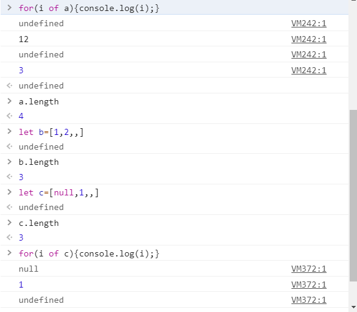

这次要介绍的是js的数组对象，其实在js里面他本质上是一种object对象（他的原型），创建和使用方法和python有点类似,最重要的一点数组里面的数据类型可以是各种类型。
<!--more-->
## 创建数组对象
使用`Array()`的方式或者直接用`[]`来创建一个数组。
```js
var arr = new Array(element0, element1, ..., elementN);
var arr = Array(element0, element1, ..., elementN);
var arr = [element0, element1, ..., elementN];

// 译者注: var arr=[4] 和 var arr=new Array(4)是不等效的，
// 后者4指数组长度，所以使用字面值(literal)的方式应该不仅仅是便捷，同时也不易踩坑
```

为了创建一个长度不为0，但是又没有任何元素的数组，可选以下任何一种方式：
```js
var arr = new Array(arrayLength);
var arr = Array(arrayLength);

// 这样有同样的效果
var arr = [];
arr.length = arrayLength;
```

这里还有一些特殊情况需要进行说明
```js
let a=[,"12",,3];//这样的数组也是成立的，这种逗号法省略的部分为undefined
let b=[1,2,,];//这里数组最后一个逗号是忽略的，也就是这里只有一个undefined
```
结果测试：


## 填充数组
可以使用类似赋值操作的方法来填充元素，如果你在以上代码中给数组操作符的是一个**非整形数值**，那么将作为一个代表数组的对象的属性(property)创建，而非作为数组的元素。
```js
var emp = [];
emp[0] = "Casey Jones";
emp[1] = "Phil Lesh";
emp[2] = "August West";
```

## 数组方法
关于数组的方法其实很多，这里我们不会一一详细介绍，大概就给一些常用的函数。
`concat()` 连接两个数组并返回一个新的数组。
`join(deliminator = ',')` 将数组的所有元素连接成一个字符串。
`push()` 在数组末尾添加一个或多个元素，并返回数组操作后的长度。
`sort()` 给数组元素排序。
`pop()` 从数组移出最后一个元素，并返回该元素。
`slice(start_index, upto_index)` 从数组提取一个片段，并作为一个新数组返回。

`map(callback[, thisObject])` 在数组的每个单元项上执行`callback`函数，并把返回包含回调函数返回值的新数组（译者注：也就是遍历数组，并通过callback对数组元素进行操作，并将所有操作结果放入数组中并返回该数组）。
```js
var a1 = ['a', 'b', 'c'];
var a2 = a1.map(function(item) { return item.toUpperCase(); });
console.log(a2); // logs A,B,C
```


`filter(callback[, thisObject])` 返回一个包含所有在回调函数上返回为true的元素的新数组（译者注：callback在这里担任的是过滤器的角色，当元素符合条件，过滤器就返回true，而filter则会返回所有符合过滤条件的元素）。
```js
var a1 = ['a', 10, 'b', 20, 'c', 30];
var a2 = a1.filter(function(item) { return typeof item == 'number'; });
console.log(a2); // logs 10,20,30
```


`every(callback[, thisObject])` 当数组中每一个元素在`callback`上被返回true时就返回true（译者注：同上，every其实类似`filter`，只不过它的功能是判断是不是数组中的所有元素都符合条件，并且返回的是布尔值）。
```js
function isNumber(value){
  return typeof value == 'number';
}
var a1 = [1, 2, 3];
console.log(a1.every(isNumber)); // logs true
var a2 = [1, '2', 3];
console.log(a2.every(isNumber)); // logs false
```

`some(callback[, thisObject])` 只要数组中有一项在callback上被返回true，就返回true（译者注：同上，类似every，不过前者要求都符合筛选条件才返回true，后者只要有符合条件的就返回true）。
```js
function isNumber(value){
  return typeof value == 'number';
}
var a1 = [1, 2, 3];
console.log(a1.some(isNumber)); // logs true
var a2 = [1, '2', 3];
console.log(a2.some(isNumber)); // logs true
var a3 = ['1', '2', '3'];
console.log(a3.some(isNumber)); // logs false
```

## 数组推导式
这个其实有点类似于python里面的列表推导式或者列表条件筛选操作，主要还是对上面的map()和filter()做了一些改进吧，让他的使用更方便了。

```js
var numbers = [1, 2, 3, 4];
var doubled = [for (i of numbers) i * 2];
console.log(doubled); // logs 2,4,6,8
```
这种方法等价于map函数
```js
var doubled = numbers.map(fuction(i){return i*2};);
```

```js
var numbers = [1, 2, 3, 21, 22, 30];
var evens = [i for (i of numbers) if (i % 2 === 0)];
console.log(evens); // logs 2,22,30
```
这种方法等价于filter函数
```js
var events=numbers.filter(fuction(i){return i%2==0;});
```