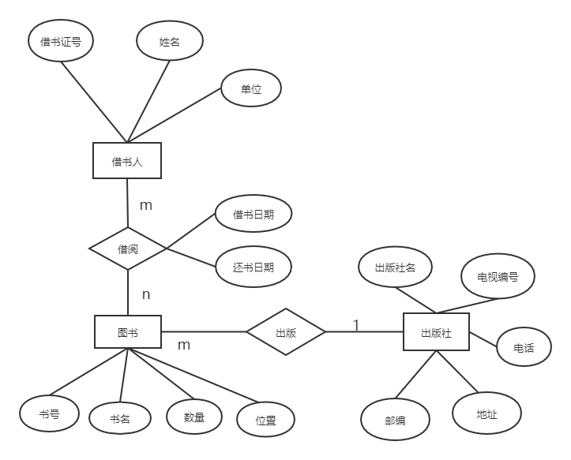

title: 数据库E-R图介绍
tags: 数据库系统
date: 2020-09-10 22:37:19
---
教师节快乐，害，今天听了一整天的新裤子的关于夜晚和失眠的世界，果然我还是喜欢music和乐队还有老歌，9月10号嗯，今天的到来其实也宣告暑假的一切都告一段落了（祝国赛的朋友们都能取得好成绩！），新学期开始了，害又要开始学习了，第一节课老师就来整英语，真难为我，呜呜呜。行吧，正好做作业就写写数据库的东西吧，首先声明这篇博客差不多是一种笔记吧，大部分的文字来源于书本和网上的博客，书本是王珊和萨师煊的《数据库系统概论》，博客的话参考了比较多，这里就挂一两个吧[E-R 图简介](https://blog.csdn.net/Medran/article/details/78424499),[数据库的设计](https://blog.csdn.net/qq_36513534/article/details/82219977)
<!--more-->
## 数据库E-R图介绍
E-R模型是指Entity Relationship Diagrams（实体关系模型）  
**E-R图3个要素：实体，属性，关系**。E-R图提供了表示实体型、属性和联系的方法。 
- 实体型用矩形表示，矩形框内写明实体名。
- 属性用椭圆形表示，并用无向边将其与相应的实体型连接起来。
- 联系用菱形表示，菱形框内写明联系名，并用无向边分别与有关实体型连接起来，同时在无向边旁标上联系的类型（1:1、1:n或m:n）  

**连线**：实体和属性之间、实体与联系之间、联系与属性之间用直线连接，并在直线上标注联系的类型。（注意：对于1：1的联系，要在两个实体连线方向各写1，1：n关系的，要在一的方向写1，多的方向写N；对于N:M关系的，则要在两个实体连线方向各写N,M）

|  1:1联系   | 1：n联系  |m:n联系 |
|  :----:| :----:  |:----:  |
| 将联系与任意端实体所对应的关系模式合并，加入另一端实体的码和联系的属性。  | 将联系与n端实体所对应的关系模式合并，加入1端实体的码和联系的属性。 |将m:n联系转换成一个关系模式。将该联系相连的各实体的码和联系本身的属性转换为关系的属性。 |

## 实例——图书借阅管理系统
数据库要求提供下述服务：
- 可随时查询书库中现有书籍的品种、数量与存放位置。所有各类书籍均可由书号惟一标识。
- 可随时查询书籍借还情况，包括借书人单位、姓名、借书证号、借书日期和还书日期。约定：任何人可借多种书，任何一种书可为多个人所借，借书证号具有惟一性。
- 当需要时，可通过数据库中保存的出版社的电报编号、电话、邮编及地址等信息向相应出版社增购有关书籍。约定，一个出版社可出版多种书籍，同一本书仅为一个出版社出版，出版社名具有惟一性。  

